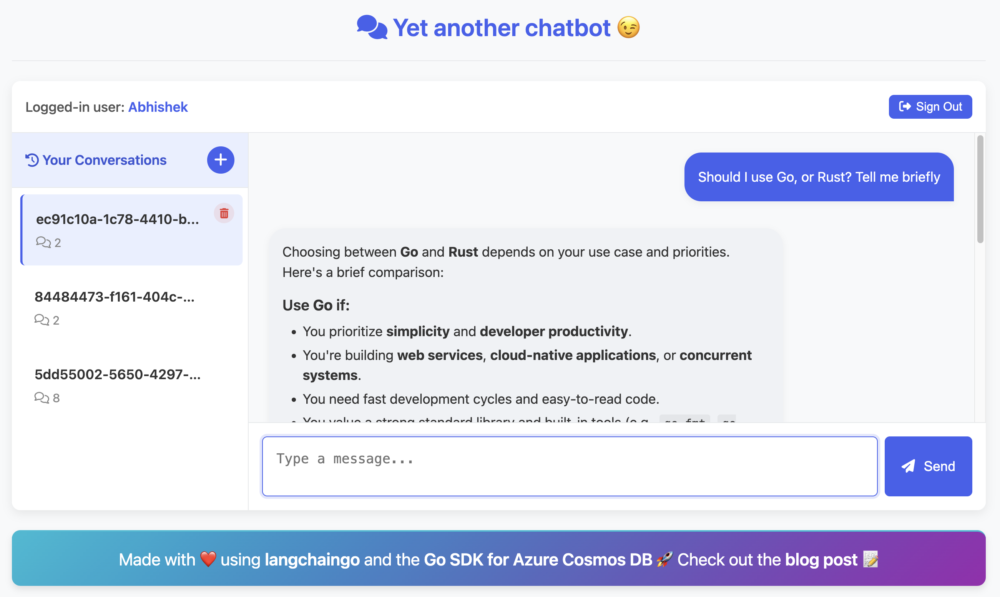
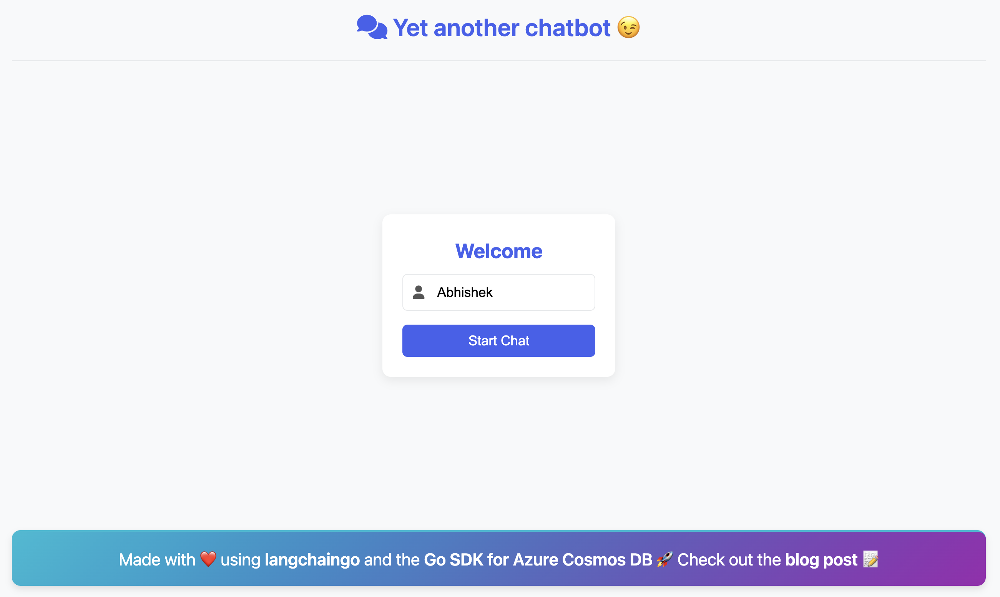

# Implement Chat History for AI Applications Using Azure Cosmos DB Go SDK



This application demonstrates a chat history implementation for Azure Cosmos DB NoSQL API using [langchaingo](https://github.com/tmc/langchaingo) and the [Go SDK for Azure Cosmos DB](https://learn.microsoft.com/en-us/azure/cosmos-db/nosql/sdk-go). If you haven't used the Go SDK before, this application can be a useful and practical way to learn the basics, including operations like [read](https://pkg.go.dev/github.com/Azure/azure-sdk-for-go/sdk/data/azcosmos#ContainerClient.ReadItem), [upsert](https://pkg.go.dev/github.com/Azure/azure-sdk-for-go/sdk/data/azcosmos#ContainerClient.UpsertItem), etc. It also demonstrates an example of how to use the [Azure Cosmos DB Linux-based emulator](https://learn.microsoft.com/en-us/azure/cosmos-db/emulator-linux) (in *preview* at the time of writing) for integration tests with [Testcontainers for Go](https://golang.testcontainers.org/).

> Read this blog post for details: [Implementing Chat History for AI Applications Using Azure Cosmos DB Go SDK](https://devblogs.microsoft.com/cosmosdb/implementing-chat-history-for-ai-applications-using-azure-cosmos-db-go-sdk)

## Features

- Chatbot web interface with streaming responses
- Chat history stored in Azure Cosmos DB - lets you access past conversation history
- Ability to delete all messages in a conversation
- Run locally using the Azure Cosmos DB emulator or the actual Azure Cosmos DB service

## Initial setup

You need to set up and configure the following components before running the application.

### Basic prerequisites

- [Go programming language](https://go.dev/doc/install)
- [Docker](https://docs.docker.com/engine/install/) - if you need to use Azure Cosmos DB emulator for the application, and run tests
- An Azure subscription. If you don't have one, you can create a [free Azure account](https://azure.microsoft.com/en-us/free/).

### Azure Cosmos DB

You can run the application using either the Azure Cosmos DB Linux emulator or the actual Azure Cosmos DB service. The emulator is a great way to develop and test your application locally without incurring costs.

#### Option 1: Azure Cosmos DB emulator (Local Development)

Create a directory to persist emulator data and run it using Docker:

```bash
mkdir emulator_data

docker run --publish 8081:8081 --publish 1234:1234 --mount type=bind,source=./emulator_data,target=/data mcr.microsoft.com/cosmosdb/linux/azure-cosmos-emulator:vnext-preview
```

> Refer to the [Running](https://learn.microsoft.com/en-us/azure/cosmos-db/emulator-linux#running) section in the emulator documentation for more details.

#### Option 2: Azure Cosmos DB service

If you want to use the actual Azure Cosmos DB service, [Create an Azure Cosmos DB account](https://learn.microsoft.com/en-us/azure/cosmos-db/nosql/how-to-create-account?tabs=azure-portal#create-an-account) in your Azure subscription. If for some reason you cannot create an Azure subscription, [try Azure Cosmos DB for NoSQL free](https://cosmos.azure.com/try/).

> Note the Azure Cosmos DB account connection string for later use

#### Container configuration

Regardless of which option you choose, ensure that you:

- Create a database to store chat history and a container within that database. You can follow the instructions in [Create a database and container](https://learn.microsoft.com/en-us/azure/cosmos-db/nosql/quickstart-portal#create-a-database-and-container) section of the documentation.
- Configure the container to use `/userid` as the partition key (this is **mandatory** for the application to work)
- (Optionally) Enable [Time To Live](https://learn.microsoft.com/en-us/azure/cosmos-db/nosql/time-to-live) (TTL) on the container if you want chat history data to expire after a certain period.

### Azure OpenAI setup

You can use any LLM supported with `langchaingo`. This example uses Azure OpenAI Service that provides access to OpenAI's models including the GPT-4o, GPT-4o mini (and more), as well as embedding models.

[Create an Azure OpenAI Service](https://learn.microsoft.com/en-us/azure/ai-services/openai/how-to/create-resource?pivots=web-portal#create-a-resource) resource.  In this example, we will use the `gpt-4o` - [deploy it](https://learn.microsoft.com/en-us/azure/ai-services/openai/how-to/create-resource?pivots=web-portal#deploy-a-model) using the Azure AI Foundry portal.

Make sure to note the Azure OpenAI resource endpoint and API key, as you will need them to configure the application.

> If you choose a different LLM and embedding model, you will need to make slight changes to the code - [check this part in server.go](https://github.com/AzureCosmosDB/cosmosdb-chat-history-langchaingo/blob/main/server/server.go#L90)

## Running the application

Clone this repository:

```bash
git clone https://github.com/AzureCosmosDB/cosmosdb-chat-history-langchaingo

cd cosmosdb-chat-history-langchaingo
```

Set up environment variables:

```bash
# Cosmos DB Configuration
export COSMOSDB_DATABASE_NAME="your_database_name"
export COSMOSDB_CONTAINER_NAME="your_container_name"

# Choose ONE of the following connection methods:

# Option 1: For Cosmos DB service
export COSMOSDB_CONNECTION_STRING="your_connection_string"

# Option 2: For Cosmos DB Emulator
export COSMOSDB_CONNECTION_STRING="AccountEndpoint=https://localhost:8081/;AccountKey=C2y6yDjf5/R+ob0N8A7Cgv30VRDJIWEHLM+4QDU5DE2nQ9nDuVTqobD4b8mGGyPMbIZnqyMsEcaGQy67XIw/Jw==;"

# Azure OpenAI Configuration
export OPENAI_BASE_URL="your-openai-endpoint" # e.g., https://your-resource-name.openai.azure.com/
export OPENAI_API_KEY="your-api-key"
export AZURE_OPENAI_MODEL_NAME="gpt-4o"  # or your deployed model name
```

Run the application:

```bash
go mod tidy
go run main.go
```

> This will start a web server on `http://localhost:8080`.

## Using the chatbot



1. Open your browser to http://localhost:8080
2. Enter a user ID of your choice to log in. This user ID will be used to store and retrieve your chat history (the user ID is not authenticated and is only used for demonstration purposes)
3. Start having conversations with the AI assistant. You should get real-time streaming responses.
4. The conversation history will be automatically saved to Cosmos DB
5. You can sign out and log back in with the same user ID later to continue your conversation

> Note: The user ID and sign-in/sign-out in this application are for demonstration purposes only and do not implement actual authentication or security features.

## Running tests (optional)

To run the tests for the Azure Cosmos DB chat history component, use the following command (if you already have the emulator running for the application, make sure to shut it down since the test starts a new instance of the emulator):

```bash
go test -v github.com/abhirockzz/langchaingo-cosmosdb-chat-history/cosmosdb
```

To run the integration tests for the application (if you already have the emulator running for the application, make sure to shut it down since the test starts a new instance of the emulator):

```bash
export COSMOSDB_ENDPOINT_URL="http://localhost:8081"
export COSMOSDB_DATABASE_NAME="chat_app_db"
export COSMOSDB_CONTAINER_NAME="chats"

export OPENAI_BASE_URL="your-openai-endpoint" # e.g., https://your-resource-name.openai.azure.com/
export OPENAI_API_KEY="your-api-key"
export AZURE_OPENAI_MODEL_NAME="gpt-4o"

# Set port if not provided
export PORT=${PORT:-8080}

# Run the web server
go test -v github.com/abhirockzz/langchaingo-cosmosdb-chat-history/server
```

## Additional info

Here are some additional notes for this project.

### App architecture

- Frontend: Simple HTML/CSS/JS interface in the [static](./static) directory
- Backend: [Go web server](./server/) handling API requests and LLM interactions
- Chat history implementation for `langchaingo` is in the [cosmosdb](./cosmosdb/) directory

### API Endpoints

The application exposes the following API endpoints:

- `/api/chat/start` - Start a new chat session
- `/api/chat/stream` - Stream conversation responses
- `/api/chat/history` - Retrieve chat history for a user/session
- `/api/user/conversations` - List all conversations for a user
- `/api/chat/delete` - Delete a conversation
